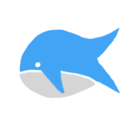

<p align="center">
  
</p>

<div align="center">
  
[Live App](https://p2p.positive-intentions.com) | [Reddit](https://www.reddit.com/r/positive_intentions) | [Medium](https://medium.com/@positive.intentions.com) | [Discord](https://discord.gg/unnQnR67nR)
</div>

<div align="center">
  
 
 
 
 
 
[](https://github.com/positive-intentions/p2p/actions/workflows/pages/pages-build-deployment)
[](https://github.com/positive-intentions/p2p/actions/workflows/codeql.yml)

</div>

# P2P

> ⚠️ **WARNING:** This project is not production-ready. It is an unstable experimental proof-of-concept and may contain bugs and/or incomplete features. Use it at your own risk.


a thin wrapper around peerjs with some functionalities for “intuitive” p2p communication.

this is a lighweight version of what is being used in [our chat app](https://chat.positive-intentions.com/). it will be developed with the aim to replace what is being used.

this is early development on this and it’s missing all the bells-and-whistles seen in the chat app. It’s an unstable experimental work-in-progress. it may contain bugs and/or incomplete features. provided for demo and educational purposes only.


## Example
```js
const state = {
    number: 0
}

const appiSchema = {
    addNumber: (state, actions) => [
        (request, response, next) => {
            const { number } = request;
            const newNumber = actions.addNumber(number);
            response({ number: newNumber });
        }
    ],
    getNumber: (state, actions) => [
        (request, response, next) => {
            response({ number: state.number });
        }
    ]
}

const actions = {
    addNumber: (number) => {
        state.number += number;
        return state.number
    }
}

const contacts = [
    {
        peerId: '456789',
        keys: [
            {
                created: '...',
                public: '...',
                private: '...',
                symmetric: '...'
            },
            {
                created: '...',
                public: '...',
                private: '...',
                symmetric: '...'
            }
        ]
    },
    {
        peerId: '789123',
        keys: [
            {
                created: '...',
                public: '...',
                private: '...',
                symmetric: '...'
            }
        ]
    }
];

<PeerProvider
    peerId="123456"
    config={{}}
    contacts={contacts}
    appiSchema={appiSchema}
    state={state}
    actions={actions}
    onConnection={onConnection}
>
    {children}
</PeerProvider>
```

## Usage

```js

const {
    peer,
    emit,
    call
    streams
    connections
} = usePeer()

```

to do:
- handle condition for tab already in use.
- reset event listeners when state changes
- use peerjs to create vanilla webrtc data connections.

### How You Can Help

- **Feedback**: Your insights are invaluable. Share your thoughts on current features, suggest new ones, or report any bugs you encounter.
- **Development**: Interested in contributing code? [Let's talk!](https://www.reddit.com/r/positive_intentions).
- **Spread the Word**: Help us grow by sharing the app with others who value privacy and control over their digital communication.
- **Github Stars**: If you like the project, consider starring the repository. It helps others discover it and boosts our motivation.
- **Sponsorship**: Development is fueled by passion and coffee. Your sponsorship helps keep both flowing.
